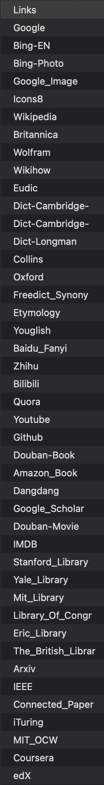

```{=html}
<style>
  td,
  th {
    border: none !important;
  }

  table#badge {
    border-collapse: separate;
    border-spacing: 0 0px;
  }

  footer summary {
    display: inline;
  }

  img#avatar {
    border-radius: 50%;
  }
</style>
```
`<br />`{=html}

::: {align="center"}
`<a href="https://github.com/renhong-zhang/quick-search-tool">`{=html}
``{=html}
`</a>`{=html}

``{=html}
```{=html}
<h3 align="center">
```
@renhong-zhang/quick-search-tool
```{=html}
</h3>
```
```{=html}
<p align="center">
```
`<b>`{=html}A Powerful Search Tool for Your Apple
Devices`</b>`{=html}`</br>`{=html} ``{=html} `<sub>`{=html}This tool
aims to search multiple keywords in several sites' search engines
simultaneously, with optional templates for different usage scenarios,
such as researching various concepts or searching for books with
numerous difficulties in the same field.`<sub>`{=html} `<br>`{=html}
`<a href="asset.doc.link">`{=html}`<strong>`{=html}Explore
quick-search-tool Docs »`</strong>`{=html}`</a>`{=html} `<br>`{=html}
`<br>`{=html}``{=html}
`<a href="https://github.com/renhong-zhang/quick-search-tool#Demo">`{=html}View
Demo`</a>`{=html} ·
`<a href="https://github.com/renhong-zhang/quick-search-tool/issues/new?assignees=-&labels=bug&template=bug_report.yml">`{=html}Report
bug`</a>`{=html} ·
`<a href="https://github.com/renhong-zhang/quick-search-tool/issues/new?assignees=&labels=feature&template=feature_request.yml">`{=html}Request
feature`</a>`{=html}
```{=html}
</p>
```
:::

```{=html}
<p align="left">
```
```{=html}
<table border="00" width="100%" style="margin: 0px;" id="badge" cellspacing="0">
```
```{=html}
<tr>
```
```{=html}
<td>
```
Prerequisites
```{=html}
</td>
```
```{=html}
<td>
```
`<a href="#">`{=html}``{=html}`</a>`{=html}
/
`<a href="#">`{=html}``{=html}`</a>`{=html}
/
`<a href="#">`{=html}``{=html}`</a>`{=html}
```{=html}
</td>
```
```{=html}
</tr>
```
```{=html}
<tr>
```
```{=html}
<td>
```
Languages & Tools
```{=html}
</td>
```
```{=html}
<td>
```
`<a href="#">`{=html}``{=html}`</a>`{=html}
`<a href="#">`{=html}``{=html}`</a>`{=html}
```{=html}
</td>
```
```{=html}
</tr>
```
```{=html}
<tr>
```
```{=html}
<td>
```
License
```{=html}
</td>
```
```{=html}
<td>
```
`<a href="https://opensource.org/licenses/MIT">`{=html}``{=html}`</a>`{=html}
```{=html}
</td>
```
```{=html}
</tr>
```
```{=html}
<tr>
```
```{=html}
<td>
```
State
```{=html}
</td>
```
```{=html}
<td>
```
`<a href="https://github.com/renhong-zhang/quick-search-tool/graphs/commit-activity">`{=html}``{=html}`</a>`{=html}
```{=html}
</td>
```
```{=html}
</tr>
```
```{=html}
</table>
```
```{=html}
</p>
```
[](#table-of-contents)

```{=html}
<details open>
```
```{=html}
<summary>
```
`<big>`{=html}`<b>`{=html}Table of Contents`</big>`{=html}`</b>`{=html}
```{=html}
</summary>
```
```{=html}
<ol>
```
```{=html}
<li>
```
`<a href="#demo">`{=html}Demo`</a>`{=html}
```{=html}
</li>
```
```{=html}
<li>
```
`<a href="#about-the-project">`{=html}About The Project`</a>`{=html}
```{=html}
</li>
```
```{=html}
<ul>
```
```{=html}
<li>
```
`<a href="#supported-sites-">`{=html}Supported Sites `</a>`{=html}
```{=html}
</li>
```
```{=html}
</ul>
```
```{=html}
<ul>
```
```{=html}
<li>
```
`<a href="#built-with">`{=html}Built With`</a>`{=html}
```{=html}
</li>
```
```{=html}
</ul>
```
```{=html}
<li>
```
`<a href="#getting-started">`{=html}Getting Started`</a>`{=html}
```{=html}
</li>
```
```{=html}
<ul>
```
```{=html}
<li>
```
`<a href="#prerequisites">`{=html}Prerequisites`</a>`{=html}
```{=html}
</li>
```
```{=html}
</ul>
```
```{=html}
<ul>
```
```{=html}
<li>
```
`<a href="#installation">`{=html}Installation`</a>`{=html}
```{=html}
</li>
```
```{=html}
</ul>
```
```{=html}
<li>
```
`<a href="#usage">`{=html}Usage`</a>`{=html}
```{=html}
</li>
```
```{=html}
<li>
```
`<a href="#author-">`{=html}Author `</a>`{=html}
```{=html}
</li>
```
```{=html}
<li>
```
`<a href="#how-can-i-support-you">`{=html}How can I support
you?`</a>`{=html}
```{=html}
</li>
```
```{=html}
<li>
```
`<a href="#acknowledgments">`{=html}Acknowledgments`</a>`{=html}
```{=html}
</li>
```
```{=html}
<li>
```
`<a href="#license">`{=html}License`</a>`{=html}
```{=html}
</li>
```
```{=html}
</ol>
```
```{=html}
</details>
```
[](#demo)

## Demo

```{=html}
<p align="center">
```
`<a href="#">`{=html}
``{=html} `</a>`{=html}
```{=html}
</p>
```
[](#about-the-project)

## About The Project

This tool aims to search multiple keywords in several sites' search
engines simultaneously, with optional templates for different usage
scenarios, such as researching various concepts or searching for books
with numerous difficulties in the same field.

### Supported Sites

A list of supported sites is shown below:
```{=html}
<p align="center">
```
`<a href="#">`{=html}
``{=html} `</a>`{=html}
```{=html}
</p>
```
### Built With

```{=html}
<p align="left">
```
```{=html}
<table border="00" width="100%" style="margin: 0px;" id="badge" cellspacing="0">
```
```{=html}
<tr>
```
```{=html}
<td>
```
`<b>`{=html}Major Frameworks/Libraries`</b>`{=html}
```{=html}
</td>
```
```{=html}
<td>
```
`<a href="#">`{=html}``{=html}`</a>`{=html}`<br>`{=html}`<a href="#">`{=html}``{=html}`</a>`{=html}
```{=html}
</td>
```
```{=html}
</tr>
```
```{=html}
</table>
```
```{=html}
</p>
```
[](#getting-started)

## Getting Started

### Prerequisites

Make sure your system satisties one of the following versions: \*
`macOS` \>=11.0 \* `iOS` \>=14.0 \* `iPadOS` \>= 14.0

### Installation

Install **Shortcuts Version** by simply click the following button and
follow the steps shown in the `iCloud.com`:

`<br>`{=html}

::: {align="center"}
`<a href="https://www.icloud.com/shortcuts/029aa394b5314d0f9258af8d9bd4fb4d">`{=html}``{=html}`</a>`{=html}
:::

`<br>`{=html}

[](#usage)

## Usage

1.  Click to run the `Multisearch_Tool_Share` in Shortcuts
2.  Input different keywords you want to search to the text box by split
    them up to lines.
3.  choose the template you would like to use, or click `Custom` to
    choose multiple sites from a list of supported sites.
4.  Wait the browser to open the searched result in different tabs. The
    first time you use this tool should give permission of accessing the
    sites you choose to the `Shortcuts.app`

[](#author-)

## Author

```{=html}
<p align="left">
```
```{=html}
<table border="00" width="100%" style="margin: 0px;" id="badge" cellspacing="0">
```
```{=html}
<tr>
```
```{=html}
<td width="20%">
```
`<a href="https://github.com/renhong-zhang">`{=html}``{=html}`</a>`{=html}
```{=html}
</td>
```
```{=html}
<td>
```
`<big>`{=html}`<b>`{=html}Renhong Zhang`</b>`{=html}`</big>`{=html}
`<br>`{=html} Github:
`<a href="https://github.com/renhong-zhang">`{=html}@renhong-zhang`</a>`{=html}
```{=html}
</td>
```
```{=html}
</tr>
```
```{=html}
</table>
```
```{=html}
</p>
```
[](#how-can-i-support-you)

## How can I support you?

There are lots of ways to support me! I would be so happy if you gave
this repository a ⭐️, and told your friends about this little corner of
the Internet

[](#acknowledgments)

## Acknowledgments

[](#license)

## License

[MIT](https://opensource.org/licenses/MIT)

Copyright © 2022-present, Renhong Zhang
